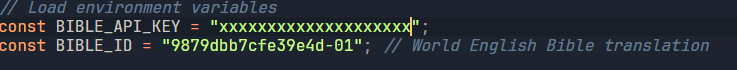
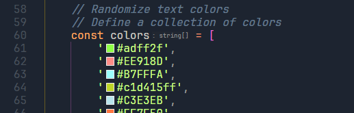

**A simple bible verse preview extension using CTRL+ALT+selection**
<P align="center">
  <Video src="https://github.com/user-attachments/assets/6d17408b-2aab-4c51-b346-a7484785d9f9"></Video>
  <Video src="https://github.com/user-attachments/assets/50134f06-bf4f-4601-8cd9-3c10657d32ec"></Video>
</P>

Steps to build
1. Pull the repository and install packages.
  ```sh
  git pull https://github.com/bushieman/Bible-Verse-Extension.git
  pnpm i
  ```

2. In the src/components/BibleVerse.jsx, replace the api key with your specific key from https://scripture.api.bible/ and change the bible id from https://docs.api.bible/guides/bibles to your preferred translation. 
  

3. Finally run the following commands. For firefox, make sure to `npm run build:firefox`
  ```sh
  npm run build
  npm run zip
  ```

4. Now all you need to do is extract the generated zip file in /dist and load unpacked the extracted folder in chrome extensions. 
   
5. For tweaks, run `npm run dev` and make changes then repeat steps 3 and 4. NB: Tweak the text colors to your liking by placing the HEX codes on colors list in src/components/Home.jsx
   
